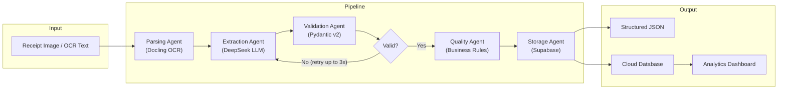
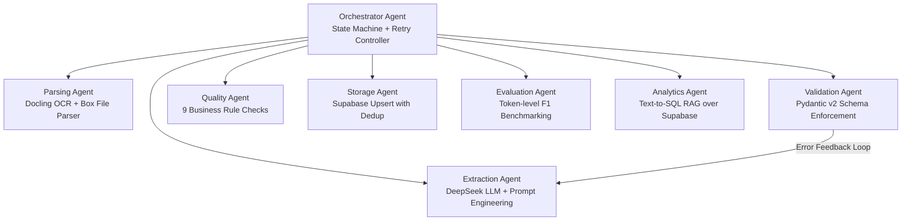

<div align="center">

# 🏎️ Carrera AI

### Multi-Agent Architecture for Intelligent Document Processing

[](https://python.org)
[](https://langchain.com)
[](https://pydantic.dev)
[](https://supabase.com)
[](https://streamlit.io)
[](https://deepseek.com)

---

**An end-to-end, production-grade pipeline that processes 626 scanned receipts from the [SROIE 2019](https://rrc.cvc.uab.es/?ch=13) dataset using a multi-agent architecture powered by DeepSeek LLM, achieving a 91.55% F1 score with 100% JSON compliance and 100% database insertion success rate.**

[Architecture](#architecture) · [Performance](#performance-metrics) · [Agents](#multi-agent-architecture) · [Setup](#setup--installation) · [Usage](#usage) · [Tech Stack](#tech-stack)

</div>

---

## Highlights

| Metric | Value |
|:--|:--|
| Receipts Processed | **626** |
| Overall F1 Score | **91.55%** |
| JSON Parse Success | **100%** |
| Pydantic Validation Pass | **100%** |
| Database Insert Success | **100%** |
| Avg Processing Time | **~4.42s / receipt** |
| Concurrent Workers | **10** |

---

## Architecture

The pipeline follows a sequential agent orchestration pattern where each agent owns a single responsibility. The Orchestrator drives receipts through parsing, extraction, validation, quality analysis, and storage, with an automatic retry loop that feeds validation errors back to the LLM for self-correction.



---

## Performance Metrics

Evaluated against the full SROIE 2019 training set ground truth using token-level F1, precision, recall, and exact-match accuracy.

### Field-Level Accuracy

| Field | Precision | Recall | F1 Score | Exact Match |
|:--|:--:|:--:|:--:|:--:|
| **Company** | 93.24% | 94.24% | 93.34% | 82.59% |
| **Date** | 98.56% | 98.56% | 98.56% | 98.56% |
| **Address** | 88.31% | 88.19% | 88.05% | 39.62% |
| **Total** | 87.22% | 85.78% | 86.26% | 84.35% |

### Aggregate

| Metric | Value |
|:--|:--:|
| **Overall F1 (macro avg)** | **91.55%** |
| Total Processing Time | 2,765.77s |
| Average per Receipt | 4.42s |
| Validation Failures | 0 |
| DB Insert Failures | 0 |

### Pipeline Reliability

```
JSON Compliance     ████████████████████ 100%
Validation Pass     ████████████████████ 100%
DB Insert Success   ████████████████████ 100%
```

---

## Multi-Agent Architecture

The system is composed of **7 specialized agents** coordinated by a central **Orchestrator** that manages state transitions, retry logic, and error propagation.



### Agent Responsibilities

| Agent | Module | Role |
|:--|:--|:--|
| **Orchestrator** | `agents/orchestrator.py` | Central state machine; drives the pipeline, manages retries (up to 3x), and propagates errors |
| **Parsing Agent** | `agents/parsing_agent.py` | Converts raw receipt images (via Docling) or SROIE box files into clean text |
| **Extraction Agent** | `agents/extraction_agent.py` | Prompts DeepSeek LLM to extract structured JSON from OCR text; accepts error feedback for self-correction |
| **Validation Agent** | `agents/validation_agent.py` | Enforces `ReceiptSchema` using Pydantic v2; raises `ValidationError` on structural failures |
| **Quality Agent** | `agents/quality_agent.py` | Applies 9 business-logic rules (anomalous totals, garbage OCR, tax logic, date format, etc.) |
| **Storage Agent** | `agents/storage_agent.py` | Persists validated receipts to Supabase via upsert with filename-based deduplication |
| **Evaluation Agent** | `agents/evaluation_agent.py` | Runs batch benchmarks against SROIE ground truth; computes precision, recall, F1, and exact match |
| **Analytics Agent** | `agents/analytics_agent.py` | Text-to-SQL RAG agent; translates natural language queries into Supabase data lookups via LLM |

### Quality Agent Rules

The Quality Agent runs 9 configurable checks on every validated receipt:

| Rule | Severity | Description |
|:--|:--:|:--|
| `HIGH_TOTAL_AMOUNT` | Warning | Total exceeds 1,000 (potential OCR misread) |
| `SUSPICIOUSLY_LOW_AMOUNT` | Warning | Total between 0 and 0.10 |
| `INVALID_TOTAL` | Critical | Total is zero or negative |
| `MISSING_COMPANY` | Critical | Company name is empty or missing |
| `MISSING_DATE` | Warning | Receipt date could not be extracted |
| `TAX_EXCEEDS_TOTAL` | Critical | Tax amount is larger than total amount |
| `NEGATIVE_TAX` | Critical | Tax amount is negative |
| `GARBAGE_COMPANY_NAME` | Warning | Company name is >50% digits (OCR noise) |
| `INVALID_DATE_FORMAT` | Warning | Date does not match YYYY-MM-DD or DD/MM/YYYY |

---

## Features

- **End-to-end pipeline** — From raw receipt image to structured database record in a single command
- **Multi-agent orchestration** — Clean separation of concerns with 7 specialized agents and a central Orchestrator
- **Docling OCR integration** — Direct image-to-text conversion for raw receipt scans (JPG/PNG/PDF)
- **LLM-powered extraction** — DeepSeek with JSON mode for reliable structured output
- **Self-correcting retry loop** — Validation errors are fed back to the LLM as context for automatic self-correction (up to 3 retries)
- **Pydantic v2 schema enforcement** — Strict type validation with 100% compliance rate
- **9-rule quality analysis** — Business-logic anomaly detection with severity levels (warning / critical)
- **Cloud persistence** — Supabase upsert with filename-based deduplication and full SQL migration
- **10-worker concurrency** — `ThreadPoolExecutor` with thread-safe statistics aggregation
- **Token-level F1 evaluation** — Automated benchmarking against SROIE ground truth with per-field metrics
- **Interactive Streamlit dashboard** — Real-time KPIs, field accuracy charts, receipt analysis, and data exploration
- **Natural language database chat** — Text-to-SQL RAG agent for conversational analytics over Supabase

---

## Data Schema

Every receipt is extracted and validated against this Pydantic schema:

```python
class ReceiptSchema(BaseModel):
    company_name: Optional[str]   # Store or merchant name
    receipt_date: Optional[str]   # Date in YYYY-MM-DD format
    receipt_time: Optional[str]   # Time in HH:MM format
    address:      Optional[str]   # Physical store address
    total_amount: Optional[float] # Total amount paid
    tax_amount:   Optional[float] # Tax amount (if stated)
    currency:     Optional[str]   # Currency code (default: MYR)
```

---

## Setup & Installation

### Prerequisites

- Python 3.10+
- [DeepSeek API key](https://platform.deepseek.com/)
- [Supabase project](https://supabase.com/) (free tier works)

### 1. Clone the Repository

```bash
git clone https://github.com/<your-username>/sroie-pipeline.git
cd sroie-pipeline
```

### 2. Create a Virtual Environment

```bash
python -m venv .venv

# Windows
.venv\Scripts\activate

# macOS / Linux
source .venv/bin/activate
```

### 3. Install Dependencies

```bash
pip install -r requirements.txt
```

### 4. Configure Environment Variables

Create a `.env` file in the project root:

```env
DEEPSEEK_API_KEY=your_deepseek_api_key
SUPABASE_URL=https://your-project.supabase.co
SUPABASE_KEY=your_supabase_anon_key
```

### 5. Set Up the Database

Run the SQL migration in your Supabase SQL Editor:

```sql
CREATE EXTENSION IF NOT EXISTS "uuid-ossp";

CREATE TABLE IF NOT EXISTS receipts (
    id UUID PRIMARY KEY DEFAULT uuid_generate_v4(),
    filename TEXT UNIQUE NOT NULL,
    company_name TEXT,
    receipt_date DATE,
    receipt_time TIME,
    address TEXT,
    total_amount NUMERIC,
    tax_amount NUMERIC,
    currency TEXT,
    raw_text TEXT NOT NULL,
    created_at TIMESTAMPTZ DEFAULT now()
);

CREATE INDEX IF NOT EXISTS idx_receipts_filename ON receipts(filename);
```

### 6. Download the Dataset

Download the [SROIE 2019 dataset](https://rrc.cvc.uab.es/?ch=13) and place it under:

```
sroie-pipeline/
  SROIE2019/
    train/
      img/       # Receipt images (.jpg)
      box/       # OCR bounding box text files (.txt)
      entities/  # Ground truth JSON files
```

---

## Usage

### Batch Processing

Process receipts through the full agent pipeline:

```bash
python main.py
```

Configure processing in `main.py`:

```python
# Process first 10 receipts from images (via Docling OCR)
process_dataset(dataset_path, output_directory, limit=10, use_images=True)

# Process all 626 receipts from box text files
process_dataset(dataset_path, output_directory, limit=None, use_images=False)
```

### Run Evaluation

Benchmark extraction accuracy against SROIE ground truth:

```bash
python evaluation/evaluator.py
```

This generates `data/evaluation_report.json` with per-field precision, recall, F1, and error analysis.

### Run Quality Agent Tests

```bash
python tests/test_quality_agent.py
```

Runs 11 test cases covering normal receipts, edge cases, and adversarial inputs against all 9 quality rules.

### Launch the Dashboard

```bash
streamlit run dashboard.py
```

The dashboard provides five tabs:

| Tab | Description |
|:--|:--|
| **Overview** | Pipeline KPIs — total receipts, success rate, average value, overall F1 |
| **Data Analysis** | Top companies by volume, receipts by month, distribution charts |
| **Accuracy & Errors** | Per-field F1 bar charts from the evaluation report |
| **Database** | Tabular view of all records stored in Supabase |
| **Chat with Database** | Natural language queries — ask questions and see generated SQL |

**Example chat queries:**
```
"What is the total spending at 99 Speedmart?"
"Show me all receipts above RM 50"
"Which company has the most receipts?"
"What is the average receipt amount by month?"
```

---

## Tech Stack

| Layer | Technology | Purpose |
|:--|:--|:--|
| **LLM** | DeepSeek v4 Flash | Entity extraction with JSON mode |
| **Framework** | LangChain / LangChain-OpenAI | Prompt templates, chain composition, output parsing |
| **Validation** | Pydantic v2 | Schema enforcement and type coercion |
| **OCR** | Docling | Raw image to markdown text conversion |
| **Database** | Supabase (PostgreSQL) | Cloud persistence with REST API |
| **Dashboard** | Streamlit + Plotly | Interactive analytics and visualization |
| **Concurrency** | ThreadPoolExecutor | 10-worker parallel batch processing |
| **Evaluation** | Custom F1 Engine | Token-level precision, recall, F1, exact match |
| **Testing** | pytest | Quality agent rule verification |
| **Environment** | python-dotenv | Secrets and configuration management |

---

## Project Structure

```
sroie-pipeline/
├── agents/                          # Multi-agent system
│   ├── orchestrator.py              # Central state machine and retry controller
│   ├── parsing_agent.py             # Docling OCR + SROIE box file parser
│   ├── extraction_agent.py          # DeepSeek LLM entity extraction
│   ├── validation_agent.py          # Pydantic v2 schema enforcement
│   ├── quality_agent.py             # 9-rule business logic quality analysis
│   ├── storage_agent.py             # Supabase upsert with deduplication
│   ├── evaluation_agent.py          # Batch F1 benchmarking agent
│   └── analytics_agent.py           # Text-to-SQL RAG agent
│
├── models/
│   └── schema.py                    # ReceiptSchema (Pydantic BaseModel)
│
├── extraction/
│   └── llm_extractor.py             # Standalone LLM extraction (legacy)
│
├── parser/
│   └── document_parser.py           # SROIE box file text extractor
│
├── validation/
│   └── schemas.py                   # Shared Pydantic schema definitions
│
├── prompts/
│   └── extraction_prompt.txt        # System prompt for DeepSeek extraction
│
├── database/
│   ├── db.py                        # Supabase client and helper functions
│   └── migration.sql                # PostgreSQL table creation script
│
├── evaluation/
│   └── evaluator.py                 # Token-level F1 evaluation engine
│
├── tests/
│   └── test_quality_agent.py        # Quality agent rule test suite
│
├── data/
│   ├── output/                      # Extracted receipt JSON files (626)
│   ├── evaluation_report.json       # Full benchmark results
│   ├── run_stats.json               # Pipeline execution statistics
│   ├── quality_test_report.json     # Quality agent test results
│   └── validation_errors.log        # Validation error audit log
│
├── SROIE2019/                       # Dataset (not tracked in git)
│   └── train/
│       ├── img/                     # Receipt images
│       ├── box/                     # OCR bounding box files
│       └── entities/                # Ground truth labels
│
├── main.py                          # Entry point — batch processing orchestrator
├── dashboard.py                     # Streamlit analytics dashboard
├── config.py                        # Configuration module
├── requirements.txt                 # Python dependencies
└── README.md
```

---

## How It Works

```
1. INPUT          Receipt image (.jpg) or OCR box file (.txt) enters the pipeline
                                    |
2. PARSE          Parsing Agent converts input to raw text via Docling or box parser
                                    |
3. EXTRACT        Extraction Agent prompts DeepSeek to produce structured JSON
                                    |
4. VALIDATE       Validation Agent enforces ReceiptSchema via Pydantic v2
                                    |
                     +--- FAIL ---> Error feedback is sent back to step 3 (up to 3 retries)
                     |
5. QUALITY         Quality Agent applies 9 business rules, flags anomalies
                                    |
6. STORE           Storage Agent upserts record to Supabase with dedup
                                    |
7. OUTPUT          Structured JSON saved locally + cloud database updated
```

---

## License

This project is built for educational and portfolio purposes using the [SROIE 2019](https://rrc.cvc.uab.es/?ch=13) public dataset.

---

<div align="center">

**Built with LangChain, DeepSeek, Pydantic, Supabase, and Streamlit**

</div>
